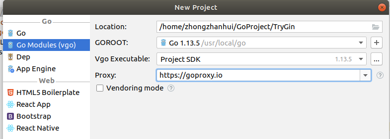
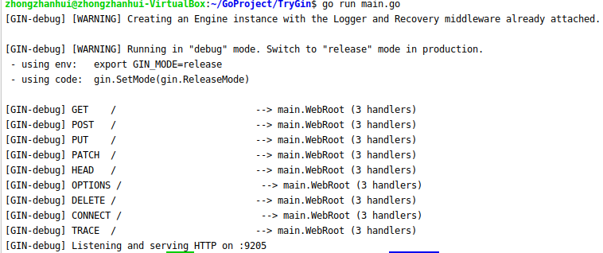
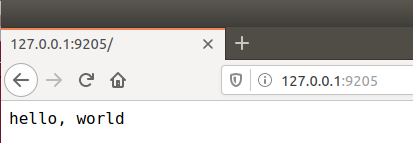
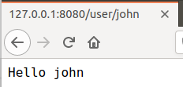
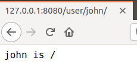
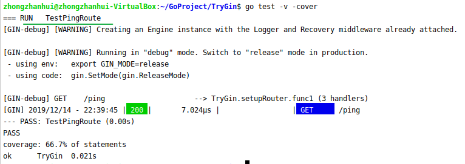
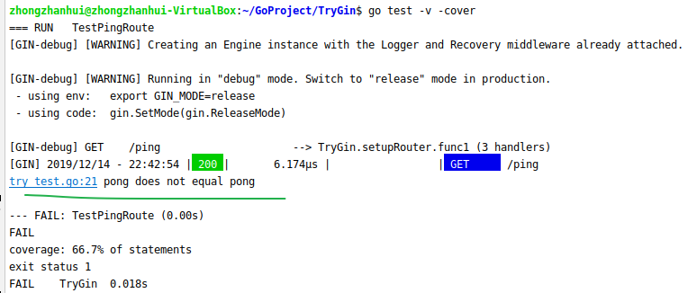

教程地址：[Gin_高性能_Golang_Web_框架的介绍和使用](https://www.yoytang.com/go-gin-doc.html))

教程里没有细讲的部分比如如何写curl命令等，参考[gin框架学习手册](https://www.cnblogs.com/-beyond/p/9391892.html)

教程配合GoLand IDE实验，将过程和笔记记录下来


## 安装和更新

教程推荐的安装方法如下

```bash
$ go get github.com/gin-gonic/gin  #首次安装，使用 `go get`命令获取即可。
$ go get -u github.com/gin-gonic/gin #更新就是常规的 `go get -u`。
```

但是使用GoLand，并且搭配Go Module的话，就不需要这么麻烦了，具体如下：


## GoLand创建Gin项目，快速运行

GoLand选择New Project



Location填写项目的目录和名称，Proxy选择好代理地址，不要勾选Vendoring mode，如果勾选了Vendoring mode的话，它会把依赖包复制到当前项目目录下的vendor文件夹里，这其实是没有必要的，依赖包下载到默认的 GOPATH/pkg/mod 下就ok了。项目创建完后出现 `go.mod`文件，里面只有项目名和go version。

> 依赖包下载的问题，参考[go安装依赖包（go get, go module）](https://blog.csdn.net/weixin_41519463/article/details/103501485)

在项目目录下创建 `main.go`文件，填入

```go
package main

import (
    "github.com/gin-gonic/gin"
    "net/http"
)

func main() {
    // 初始化引擎
    engine := gin.Default()
    // 注册一个路由和处理函数
    engine.Any("/", WebRoot)
    // 绑定端口，然后启动应用
    engine.Run(":9205")
}

/**
* 根请求处理函数
* 所有本次请求相关的方法都在 context 中，完美
* 输出响应 hello, world
*/
func WebRoot(context *gin.Context) {
    context.String(http.StatusOK, "hello, world")
}
```

光标悬停在"github.com/gin-gonic/gin"这一行代码上，按alt+enter，同步gin依赖包，随后这一行代码由红色转绿色，代表gin依赖包下载完毕。打开`go.mod`文件，可以看到多了一行gin依赖包版本的记录。这里相当于完成了 `go get github.com/gin-gonic/gin`，十分方便。

```
module TryGin

go 1.13

require github.com/gin-gonic/gin v1.5.0
```

打开Terminal，输入`go run main.go`运行项目，结果如下



打开浏览器访问http://127.0.0.1:9205/，得到响应hello world



## 路由(Router)

### Restful Api

你可以注册路由方法有 GET, POST, PUT, PATCH, DELETE 和 OPTIONS.

使用很简单，直接调用同名的方法即可。

```go
package main

import (
	"github.com/gin-gonic/gin"
	"net/http"
)
func main() {
	router := gin.Default()
	router.GET("/someGet",getting)
	//router.POST("/somePost", posting)
	//router.PUT("/somePut", putting)
	//router.DELETE("/someDelete", deleting)
	//router.PATCH("/somePatch", patching)
	//router.HEAD("/someHead", head)
	//router.OPTIONS("/someOptions", options)
	router.Run()
}
func getting(context *gin.Context){
	context.String(http.StatusOK, "getting")
}
```

在浏览器访问`http://127.0.0.1:8080/someGet`，得到


### 动态路由（参数路由）

有时候我们需要动态的路由，如 `/user/:id`，通过调用的 url 来传入不同的 id，就是说要通过GET方法将信息附在url访问链接的最后面，传递给后台：

```go
package main

import (
	"github.com/gin-gonic/gin"
	"net/http"
)
func main() {
	router := gin.Default()

	// 注册一个动态路由
	// 可以匹配 /user/joy
	// 不能匹配 /user 和 /user/
	router.GET("/user/:name", func(c *gin.Context) {
		// 使用 c.Param(key) 获取 url 参数
		name := c.Param("name")
		c.String(http.StatusOK, "Hello %s", name)
	})

	// 注册一个高级的动态路由
	// 该路由会匹配 /user/john/ 和 /user/john/send
	// 如果没有任何路由匹配到 /user/john, 那么他就会重定向到 /user/john/，从而被该方法匹配到
	router.GET("/user/:name/*action", func(c *gin.Context) {
		name := c.Param("name")
		action := c.Param("action")
		message := name + " is " + action
		c.String(http.StatusOK, message)
	})

	router.Run(":8080")
}
```

运行结果如下：




可见是无法识别 /user 的


### 路由组

一些情况下，我们会有统一前缀的 url 的需求，典型的如 Api 接口版本号 `/v1/something`。Gin 可以使用 Group 方法统一归类到路由组中：

```go
package main

import (
	"github.com/gin-gonic/gin"
	"net/http"
)
func main() {
	router := gin.Default()

	// 定义一个组前缀
	// /v1/login 就会匹配到这个组
	v1 := router.Group("/v1")
	{
		v1.GET("/home",homepage)
		//v1.POST("/login", loginEndpoint)
		//v1.POST("/submit", submitEndpoint)
		//v1.POST("/read", readEndpoint)
	}
	router.Run()
}
func homepage(ctx *gin.Context){
	ctx.String(http.StatusOK,"home")
}
```


## 中间件(Middleware)

通过中间件的方式，验证 Auth 和身份鉴别，集中处理返回的数据等等。

### 单个路由中间件

```go
package main

import (
	"github.com/gin-gonic/gin"
	"log"
	//"net/http"
)
func main() {
	router := gin.Default()

	// 注册一个路由，使用了 middleware1，middleware2 两个中间件
	router.GET("/someGet", middleware1, middleware2, handler)

	// 默认绑定 :8080
	router.Run()
}
func middleware1(c *gin.Context) {
	log.Println("exec middleware1")

	//你可以写一些逻辑代码

	// 执行该中间件之后的逻辑
	c.Next()
}
func middleware2(c *gin.Context) {
	log.Println("arrive at middleware2")
	// 执行该中间件之前，先跳到流程的下一个方法
	c.Next()
	// 流程中的其他逻辑已经执行完了
	log.Println("exec middleware2")

	//你可以写一些逻辑代码
}
func handler(c *gin.Context) {
	log.Println("exec handler")
}
```

通过`c.Next()`可以在中间件中控制调用逻辑的变化。上述代码中，访问`localhost:8080/someGet`时，先调用`middleware1`，输出"exec middleware1"后由于有`c.Next()`，跳转到下一个中间件`middleware2`，在`middleware2`中先输出"arrive at middleware2"后由于有`c.Next()`，跳转到下一个handler，输出完"exec handler"后回到`middleware2`中执行完剩下的代码。运行结果如下：


### 路由组使用中间件

路由组使用中间件和单个路由类似，只不过是要把中间件放到 `Group` 上.

```go
package main

import (
	"github.com/gin-gonic/gin"
	"log"
	"net/http"
)
func main() {
	router := gin.Default()
	// 定义一个组前缀
	// /v1/home 就会匹配到这个组
	v1 := router.Group("/v1",middleware)
	{
		v1.GET("/home",homepage)
	}
	router.Run()
}
func homepage(ctx *gin.Context){
	ctx.String(http.StatusOK,"home")
	log.Println("exec home")
}
func middleware(c *gin.Context) {
	log.Println("arrive at middleware")
	// 执行该中间件之前，先跳到流程的下一个方法
	c.Next()
	// 流程中的其他逻辑已经执行完了
	log.Println("exec middleware")
	//你可以写一些逻辑代码
}
```

运行结果


## 参数

### Get方式(Url 查询参数)

假定一个 url 为 `/welcome?firstname=Jane&lastname=Doe`，我们想获取参数 `firstname` 的内容，可以使用`c.Query`方法。该方法始终返回一个 `string` 类型的数据，就是说如果要传数字需要用类型转换。

```go
package main

import (
	"github.com/gin-gonic/gin"
	"net/http"
)
func main() {
	router := gin.Default()

	// 定义一个组前缀
	// /v1/login 就会匹配到这个组
	v1 := router.Group("/api")
	{
		v1.GET("/register",register)
	}
	router.Run()
}
func register(ctx *gin.Context){
	username:=ctx.DefaultQuery("username","default_name")
	password:=ctx.Query("password")
	ctx.String(http.StatusOK,"your username is %s \npassword is %s",username,password) //http.StatusOK return code 200
}
```


### POST方式（表单和Body参数）

典型的如 `POST` 提交的数据，无论是 `multipart/form-data`格式还是`application/x-www-form-urlencoded`格式，都可以使用 `c.PostForm`获取到参数。该方法始终返回一个 `string` 类型的数据。

下面是一个post方式注册的例子：

```go
package main

import (
	"github.com/gin-gonic/gin"
	"log"
	"net/http"
)
func main() {
	router := gin.Default()

	v1 := router.Group("/api")
	{
		v1.POST("/register",register)
	}
	router.Run(":8080")
}
func register(ctx *gin.Context){
	log.Println("someone register")
	username:=ctx.DefaultPostForm("username","default_name")
	password:=ctx.PostForm("password")
	ctx.JSON(http.StatusOK,gin.H{
		"status":"posted",
		"username":username,
		"password":password,
	})

}
```

问题来了，在没有写前端页面的情况下，无法提交表单，那么如何进行POST请求呢？这里就用到了linux上的curl命令，参考[linux命令行下curl方式post页面](http://www.nginx.cn/4191.html)

```bash
#抓取网页
curl http://www.baidu.com

#get方式提交数据：
curl -G -d "name=value&name2=value2" http://www.baidu.com

#post方式提交数据：
curl -X POST -d "name=value&name2=value2" http://www.baidu.com 

#post方式提交json数据：
curl -H "Content-Type:application/json" -X POST --data '{"message": "sunshine"}' http://localhost:8000/

#patch方式提交数据：
curl -X PATCH -d "name=value&name2=value2" http://www.baidu.com 

#以表单的方式上传文件，相当于设置form表单的method="POST"和enctype='multipart/form-data'两个属性。
curl -F file=@/tmp/me.txt http://www.aiezu.com
```

因此这里我们要跑的命令如下（注意最好用双引号把地址给围起来，否则可能会出错，这里没有用双引号，不够规范）：

```bash
curl -X POST -d "username=zzh&password=123" 127.0.0.1:8080/api/register
```


> 拓展：[四种常见的 POST 提交数据方式](https://imququ.com/post/four-ways-to-post-data-in-http.html)


### 同时接受GET方式和POST方式的数据

参考https://www.cnblogs.com/-beyond/p/9391892.html

前提：请求方必须是使用POST方式传递，只不过URL中也包含一部分参数而已。

同时，服务器端必须使用router.POST方式来接收，不能使用router.GET方式接收，因为router.GET只能接收GET方式传递的数据。

### 上传文件和其他格式的数据

这两个部分暂时略过，需要用到时再细看。


## 数据绑定

数据绑定可以将用户传来的参数自动跟我们定义的结构体绑定在一起。

### 绑定 Get参数

使用 `c.ShouldBindQuery`方法，可以自动绑定 Url 查询参数到 `struct`.

```go
package main

import (
	"github.com/gin-gonic/gin"
	"log"
	"net/http"
)
type User struct{
	Name string `form:"name"`  //必须有`form:"name"`才能绑定
	Pwd int `form:"pwd"`
}

func main() {
	router := gin.Default()

	v1 := router.Group("/api")
	{
		v1.GET("/register",register)
	}
	router.Run(":8080")
}
func register(ctx *gin.Context){
	log.Println("someone register")
	var user User
	err:=ctx.ShouldBindQuery(&user)
	if  err== nil{
		ctx.JSON(http.StatusOK,gin.H{
			"username":user.Name,
			"password":user.Pwd,
		})
	}
}
```

这里cur命令如果不用双引号把地址给围起来，就会出错：

```bash
curl "127.0.0.1:8080/api/register?name=zzh&pwd=123"
```


### 绑定Post参数

与GET绑定方式不同的地方在于使用POST方式以及使用ShouldBind函数

```go
package main

import (
	"github.com/gin-gonic/gin"
	"log"
	"net/http"
)
type User struct{
	Name string `form:"name"`
	Pwd int `form:"pwd"`
}

func main() {
	router := gin.Default()

	v1 := router.Group("/api")
	{
		v1.POST("/register",register)
	}
	router.Run(":8080")
}
func register(ctx *gin.Context){
	var user User
	err:=ctx.ShouldBind(&user)
	if  err== nil{
		log.Println(user.Name)
		log.Println(user.Pwd)
		ctx.JSON(http.StatusOK,gin.H{
			"username":user.Name,
			"password":user.Pwd,
		})
	}
}

```

```bash
curl -X POST -d "name=zzh&pwd=123" "127.0.0.1:8080/api/register"
```


## 数据验证

对于获取的外来数据，我们要做的第一步就是校验和转换。 Gin提供了数据校验的方法，省去我们重复判断的烦恼。Gin 的**数据验证是和数据绑定结合在一起的**。只需要在数据绑定的结构体成员变量的标签添加`binding`规则即可。

下面代码验证数据，只有当用户名为zzh，密码为123时才验证通过（实际上看不出来为什么一定要跟数据绑定结合起来）。

```go
package main

import (
	"github.com/gin-gonic/gin"
	"net/http"
)
type User struct{
	Name string `form:"name" json:"name" binding:"required"`
	Pwd int `form:"pwd" json:"pwd" binding:"required"`
}

func main() {
	router := gin.Default()

	v1 := router.Group("/api")
	{
		v1.POST("/registerJSON",registerJSON)
		v1.POST("/registerFORM",registerFORM)
	}
	router.Run(":8080")
}
func registerJSON(ctx *gin.Context){
	var user_json User
	if  err:=ctx.ShouldBind(&user_json);err== nil{
		if user_json.Name == "zzh" && user_json.Pwd == 123 {
			ctx.JSON(http.StatusOK,gin.H{
				"status":"register successfully",
				"username":user_json.Name,
				"password":user_json.Pwd,
			})
		} else {
			ctx.JSON(http.StatusUnauthorized, gin.H{"status": "unauthorized"})
		}
	}
}
func registerFORM(ctx *gin.Context){
	var user_form User
	if  err:=ctx.ShouldBind(&user_form);err== nil{
		if user_form.Name == "zzh" && user_form.Pwd == 123 {
			ctx.JSON(http.StatusOK,gin.H{
				"status":"register successfully",
				"username":user_form.Name,
				"password":user_form.Pwd,
			})
		} else {
			ctx.JSON(http.StatusUnauthorized, gin.H{"status": "unauthorized"})
		}
	}
}
```

Post请求发送JSON数据

```bash
curl -H "Content-Type:application/json" -X POST --data '{"name": "zzh", "pwd":123}' "http://localhost:8080/api/registerJSON"
```

Post请求发送FORM表单

```bash
curl -X POST -d "name=zzh&pwd=123" "http://localhost:8080/api/registerJSON"
```

运行结果：


除了绑定验证之外，你还可以注册自定义的验证器。这部分比较麻烦的样子，先跳过。


## 输出响应

Gin 为我们提供了多种常见格式的输出，包括 `HTML`, `String`，`JSON`， `XML`， `YAML`。

### String

最简单的响应，返回一个字符串

```go
// 省略的代码 ...
func Handler(c *gin.Context) {
    // 使用 String 方法即可
    c.String(200, "Success")
}
// 省略的代码 ...
```

### JSON、 XML、 YAML

Gin 输出这三种格式非常方便，直接使用对用方法并赋值一个结构体给它就行了。

你还可以使用`gin.H`。`gin.H` 是一个很巧妙的设计，你可以像`javascript`定义`json`一样，直接一层层写键值对，只需要在每一层加上 `gin.H`即可。但区分这几种没什么意义其实，花里胡哨，最后响应结果都一模一样，直接用这种方式就行了：

```go
ctx.JSON(http.StatusOK,gin.H{"status":"success","format":"H_JSON"})
```


### HTML

响应时返回的是一个html页面，这个是与前端交互所必须的，Gin 使用 Html 模板就是官方标准包`html/template`, 这里给大家说一下如何在 gin 中输出 `html`。

由于 Gin 并没有强制的文件夹命名规范，所以我们必须要告诉 Gin 我们的静态资源（如图片、Css、JS 脚本等）和我们的html 模板放在了哪里，看代码：

```go
package main

import "github.com/gin-gonic/gin"

func main() {
    engine := gin.Default()
    engine.GET("/html-test", startPage)
    // 注册一个目录，gin 会把该目录当成一个静态的资源目录
    // 该目录下的资源看可以按照路径访问
    // 如 static 目录下有图片路径 index/logo.png , 你可以通过 GET /static/index/logo.png 访问到
    engine.Static("/static", "./static")
    // 注册一个路径，gin 加载模板的时候会从该目录查找
    // 参数是一个匹配字符，如 views/*/* 的意思是 模板目录有两层
    // gin 在启动时会自动把该目录的文件编译一次缓存，不用担心效率问题
    engine.LoadHTMLGlob("views/*/*")
  
    engine.Run(":8080")
}

func startPage(c *gin.Context) {
    // 输出 html
    // 三个参数，200 是http状态码
    // "shop/search" 要加载的模板路径，对应目录路径 views/shop/search.html
    // gin.H{"keywords":"macbook pro"} 是模板变量
    c.HTML(200, "shop/search", gin.H{"keywords":"macbook pro"})
}
```

由于暂时没空写前端页面，只是简单了解gin框架，因此也就没有跑这个实验代码。


## 测试

实际上 Gin 并没有提供内置方法，Gin 直接推荐使用 Go 官方包 `net/http/httptest` 来测试你的应用。

前面章节里都是通过浏览器或其他http请求模拟工具来手动模拟真实的http请求，发送http请求之后，解析返回的响应，查看响应是否符合预期；这种做法比较麻烦，而且测试结果不太可靠。这里的测试是使用httptest结合testing来实现针对handlers接口函数的单元测试。

>  参考
>
> [Go 教程 如何在 Gin 框架中测试 JSON 响应？](https://learnku.com/golang/t/26362) 一个测试简例
>
> [Go单元测试(一)：基本用法](https://www.jianshu.com/p/d6a499308b02)，里面有讲详细的测试规则，我也是看了这个文章才知道怎么测试的。

以下是项目代码文件`main.go`（极简），不需要跑起来，用到的只是他的函数`setupRouter()`

```go
package main

import (
	"github.com/gin-gonic/gin"
)

func  setupRouter() *gin.Engine{
	r := gin.Default()
	r.GET("/ping",func(ctx *gin.Context){
		ctx.String(200,"pong")
	})
	return r
}

func main() {
	engine := setupRouter()
	engine.Run(":8080")
}
```

以下是测试代码文件`try_test.go`

```go
package main

import (
	"gopkg.in/go-playground/assert.v1"
	"net/http"
	"net/http/httptest"
	"testing"
)

func TestPingRoute(t *testing.T){
	router :=  setupRouter()
	// 获取一个请求实例
	w := httptest.NewRecorder()
	// 构造请求
	// 参数依次是 请求方法、路由、参数
	req, _ := http.NewRequest("GET","/ping",nil)
	// 执行
	router.ServeHTTP(w, req)
	// 断言
	assert.Equal(t,200,w.Code)
	assert.Equal(t,"pong",w.Body.String())
}
```

注意编写测试代码文件需要遵循下面的规则

- **规则1**.单元**测试代码的go文件名必须以`_test.go`结尾**，Go语言测试工具只认符合这个规则的文件。否则会报错`[no test files] `
- **规则2**.单元测试的**函数名必须以`Test`开头**，是可导出公开的函数。备注：函数名最好是Test+要测试的方法函数名，否则会报错`testing: warning: no tests to run`
- **规则3.** 测试函数必须接收一个指向**testing.T类型**的指针作为参数，并且该测试函数不能返回任何值

在测试代码文件所在目录下运行：

```bash
go test -v -cover  
# go test显示的UT测试结果，以及花费的时间 
# -v显示单元测试的详细信息，  
# -cover会显示测试代码的覆盖率
```

>  运行 go test 会报错
>
> ```bash
> #runtime/cgo
> exec: "gcc": executable file not found in $PATH
> ```
>
> 需要安装gcc
>
> ```bash
> apt install gcc
> ```

测试结果：



可见测试通过，即响应正常（code=200）且响应值为字符串`"pong"`

`"pong\n" != "pong"`，assert的时候如果响应字符串有换行符，测试时断言assert会不通过，如下




## 总结

至此教程看完，可以看到gin框架没有数据库的内容，所以具体开发Web服务的时候用到数据库，还需要结合gorm使用。